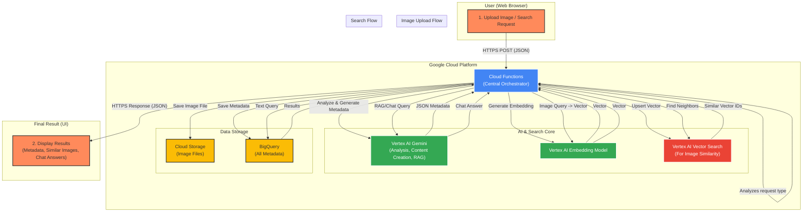

# 🚀 Intelligent DAM PoC for HSAD

## 1. Project Overview

This project is a Proof of Concept (PoC) for an **Intelligent Digital Asset Management (DAM)** system, built for **HS Ad** utilizing Google Cloud's most advanced AI technologies. It aims to completely automate and intelligently enhance the digital asset lifecycle, transforming a simple storage system into a proactive creative and strategic hub.

This final version includes advanced features like **AI-powered Vector Search** for image similarity matching and a **generative Q&A chatbot (RAG)**, providing a comprehensive, next-generation content management experience.

**Developed by Donguk Lee (dulee)**

---

## 2. Core Features

*   **🤖 AI-Powered Asset Analysis**: Upon image upload, automatically generates rich, structured metadata using Gemini.
    -   Official Product Name & Marketable Color
    -   Creative Marketing Concepts (Tags)
    -   Detailed, SEO-Optimized Alt Text
    -   Inspiring Marketing Slogans
    -   **[NEW]** Detailed English prompts for AI video generation (e.g., for Google VEO).

*   **✨ Advanced AI Search**:
    -   **Keyword Search**: Fast, accurate text-based search across all AI-generated metadata.
    -   **[NEW] Image Similarity Search**: Upload an image to find visually similar assets instantly, powered by **Vertex AI Vector Search**.
    -   **[NEW] Generative Q&A (DAM-GPT)**: Ask questions in natural language (e.g., "신혼부부에게 추천할 만한 세탁기 있어?") and receive AI-generated answers based on the asset data in the DAM.

*   **📊 Live Asset Dashboard**: A real-time doughnut chart that visualizes the distribution of registered assets by product type.

*   **💎 Professional UI/UX**: A clean, intuitive, and sophisticated web interface designed for a seamless user experience.

---

## 3. System Architecture

This system is built on a fully serverless, event-driven architecture using Google Cloud services, ensuring scalability and cost-efficiency. A central Cloud Function orchestrates all interactions between the user, AI models, and data storage.

---

## 4. Technology Stack

*   **Backend**: Cloud Functions (Python 3.12)
*   **AI Models**:
    *   **Vertex AI Gemini 2.5 Flash**: For content generation and RAG.
    *   **Vertex AI Multimodal Embedding**: To convert images into vectors.
*   **AI Search**: Vertex AI Vector Search (formerly Matching Engine)
*   **Database**: BigQuery
*   **Storage**: Cloud Storage
*   **Frontend**: HTML5, CSS3, JavaScript (Vanilla)

---

## 5. Setup & Deployment (One-Click Guide)

This guide provides a robust, step-by-step deployment process for the Google Cloud Shell environment, designed to eliminate common errors and ensure success. For full, executable scripts, please refer to the detailed project guide or commit history.

### **STEP 1: Initial Setup & Source Code Generation**
Prepares the environment, creates storage resources, and generates all source code files.

### **STEP 2: Build AI Infrastructure & Deploy Backend (One-Click)**
The core step that builds the Vector Search index/endpoint and deploys the Cloud Function with the correct resource IDs.

### **STEP 3: Connect Frontend & Run Demo**
Connects the UI to the backend and starts a local web server for testing.

---

## 6. Optional: Data Reset

To clear all test assets (images, metadata) without destroying the infrastructure, run the provided data reset script.
